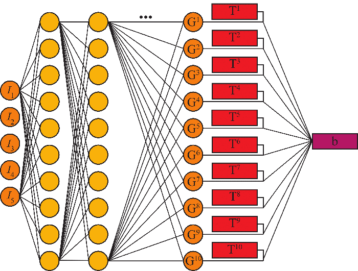

# Bayesian Invariant Neural Network with SVGD

[Quantifying model form uncertainty in Reynolds-averaged turbulence models with Bayesian deep neural networks](https://www.sciencedirect.com/science/article/pii/S0021999119300464)

[Nicholas Geneva](http://nicholasgeneva.com/), [Nicholas Zabaras](https://www.zabaras.com)

Invariant neural network used for mapping between Reynolds-Averaged Navier-Stokes flow quantities to higher-fidelity turbulence quantities. Formulation of the invariant neural network was originally proposed by [Ling *et al.*](http://doi.org/10.1017/jfm.2016.615) and Stein Variational Gradient Decent (SVGD) algorithm follows the implementation by [Zhu and Zabaras](http://doi.org/10.1016/j.jcp.2018.04.018).

### Invariant Deep Neural Network
The theoretical foundation of this invariant neural network is the non-linear eddy viscosity model developed by [Pope 1975](https://doi.org/10.1017/S0022112075003382). This neural network predicts the anisotropic tensor of the R-S using the symmetric and antisymmetric tensor components  of the velocity gradient tensor. Through  use of tensor invariants, the neural network is able to achieve both Galilean invariance as well as invariance to coordinate transformations.

### Stein Variational Gradient Decent
SVGD, originally proposed by [Liu and Wang](http://papers.nips.cc/paper/6338-stein-variational-gradient-descent-a-general-purpose-bayesian-inference-algorithm), is a non-parametric algorithm of similar form as standard gradient decent that approximates a variational distribution through a set of particles.
Each particle represents an independent neural network that is pushed towards a representation of the posterior.
The learnable parameters of each neural network are treated as random variables that are then optimized by minimizing the KL divergence.

Invariant Deep Neural Network | Stein Variational Gradient Decent
| ------------- | ------------- |
 | 

## Dependencies
* Python 3.6.5
* [PyTorch](https://pytorch.org/) 0.4.0

*Listed versions were used for development. Compatability with newer versions is likely but not guaranteed.*

## Quick Start
1. Set-up training/test flow information in main.py. The needed file structure is discussed in utils/dataManager.py. Current repository should work out-of-the-box with the provided training data.
2. One can choose to either read raw OpenFOAM files or pre-processed torch tensors (see utils/dataManager.py)
3. If the platform is only running on CPUs, set gpu=False when calling foamNet.train() in main.py.
4. `python main.py`

## Citation
Find this useful? Cite us with:
```latex
@article{geneva2019quantifying,
  title = {Quantifying model form uncertainty in {Reynolds-averaged} turbulence models with {Bayesian} deep neural networks},
  author = {Nicholas Geneva and Nicholas Zabaras},
  journal = {Journal of Computational Physics},
  year = {2019},
  issn = {0021-9991},
  doi = "https://doi.org/10.1016/j.jcp.2019.01.021",
  url = "http://www.sciencedirect.com/science/article/pii/S0021999119300464"
}
```
