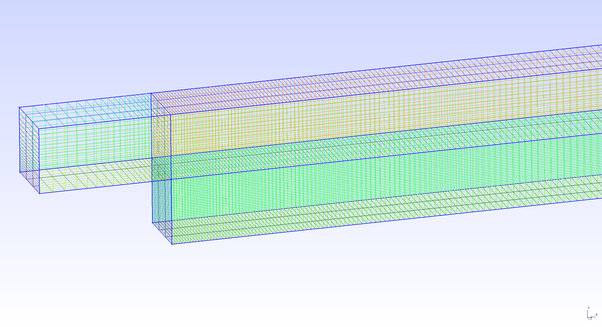
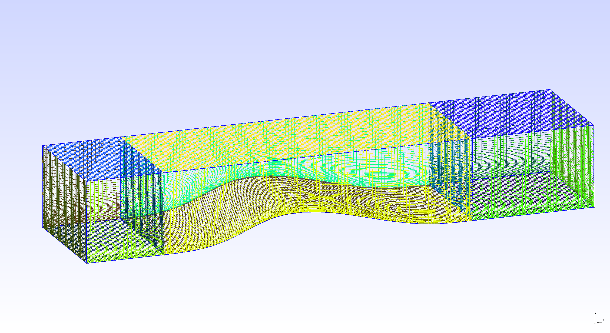
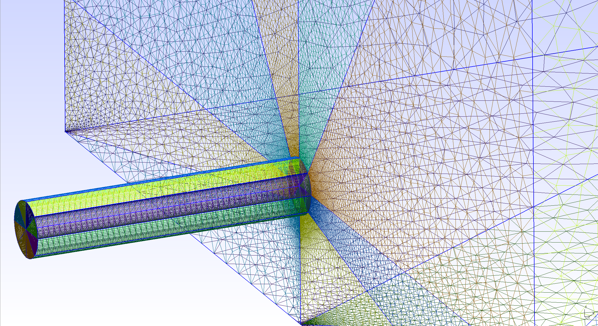
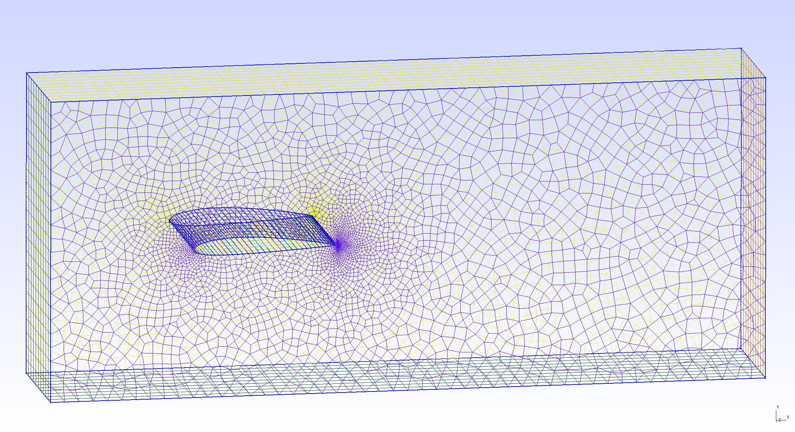
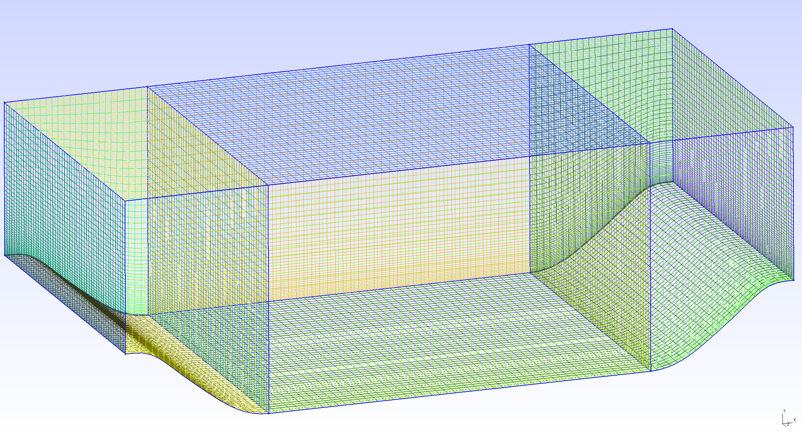
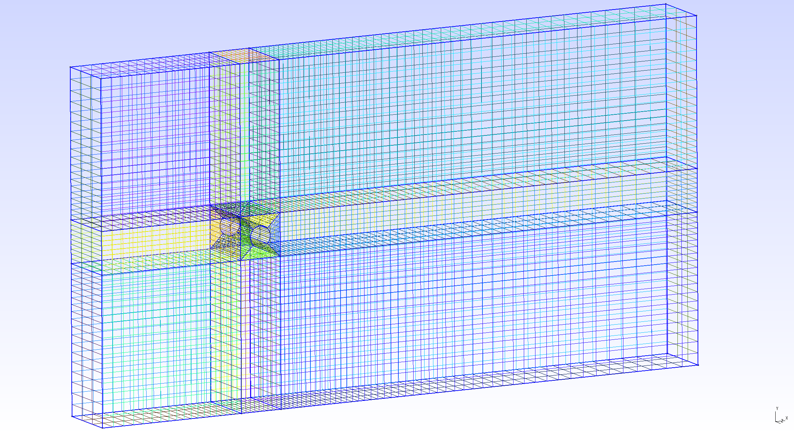
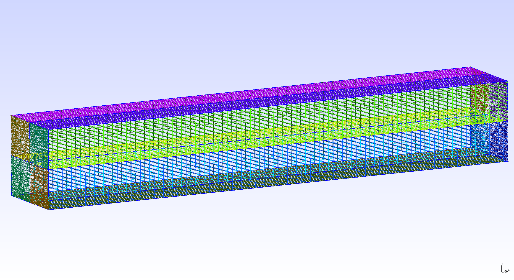
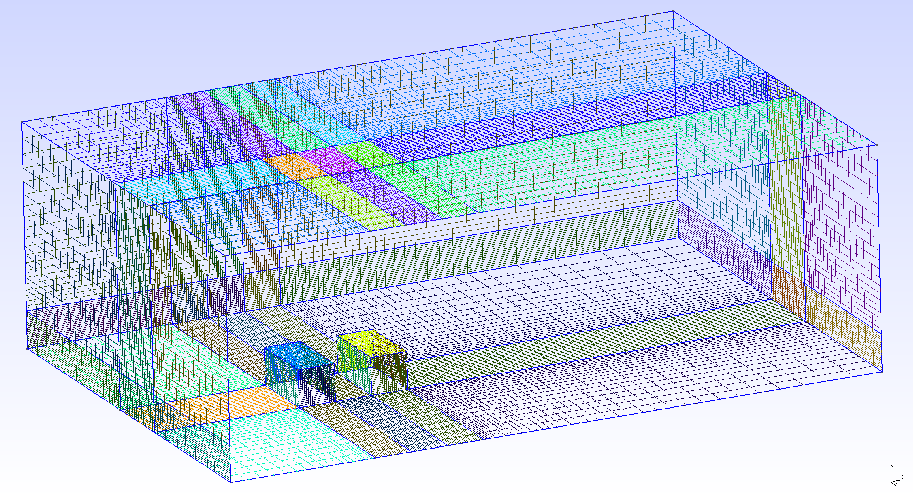
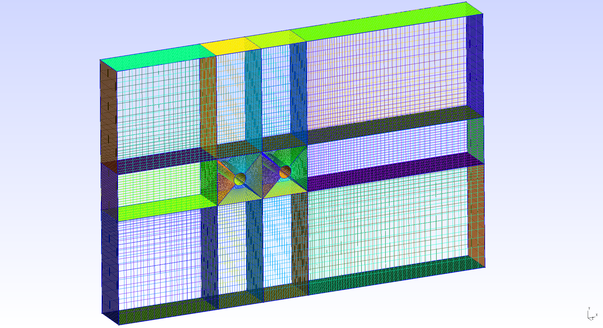
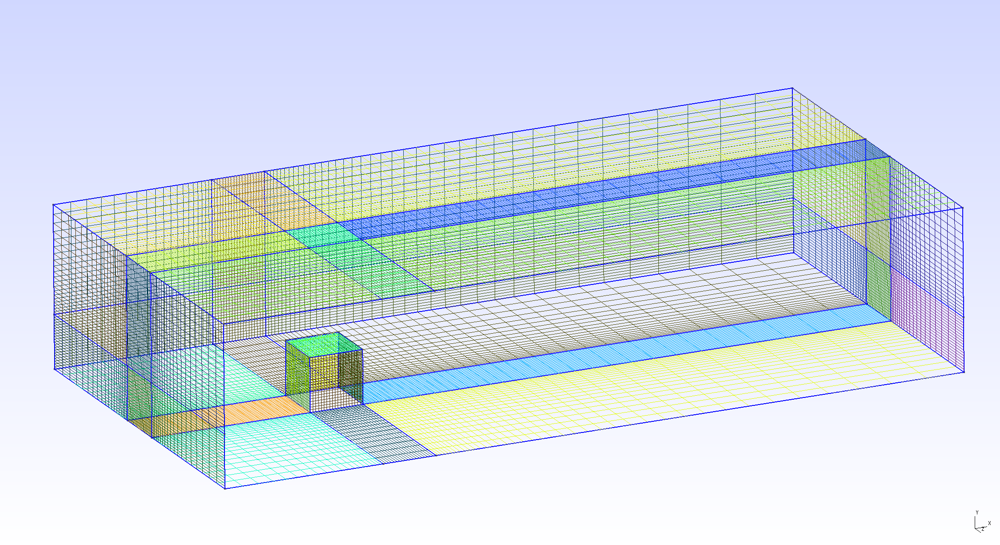

# Meshes for the Masses

[Quantifying model form uncertainty in Reynolds-averaged turbulence models with Bayesian deep neural networks](https://www.sciencedirect.com/science/article/pii/S0021999119300464)

[Nicholas Geneva](http://nicholasgeneva.com/), [Nicholas Zabaras](https://www.zabaras.com)

This repository holds a library of meshes that were created for OpenFOAM using [GMSH](http://gmsh.info/), an open-source three-dimensional finite element mesh generator. All meshes are free to use and modify for your own needs. Some of the provided flows include:

Backwards Step | Converging-Diverging Channel | Jet in Cross Flow
:-----:|:------:|:-----:
 |  | 

NACA 2412 Airfoil | Periodic Hills | Round Cylinder
:-----:|:------:|:-----:
 |  | 

Square Duct | Street Canyon | Tandem Cylinders | Wall Mounted Cube | 
:-----:|:------:|:-----:|:------:
 |  |  | 

## Instructions
### Viewing and Editing Meshes
1. Download [GMSH](http://gmsh.info/#Download) 4.0 for your favorite OS.
2. Run the executable and open the mesh file (e.g. `Rans-mesh.geo`).
3. Meshes can be edited through the GMSH interface or through the script itself using any text editor (the latter is recommended). See [GMSH documentation](http://gmsh.info/doc/texinfo/gmsh.html) for further details.
4. To see changes you've made to the script simply reload the mesh in the GMSH editor.
### Converting GMSH to OpenFOAM
1. To convert the GMSH .geo files to the OpenFOAM format we have included a small bash script.
2. In a directory place your .geo file, convert-mesh.sh and the GMSH executable. Ensure that OpenFOAM is installed on the respective system and the GMSH executable has the proper permissions to be run by bash (e.g. `chmod +x gmsh`).
3. Edit the bash file such that the mesh name and OpenFOAM directory are correct. Note: the OpenFOAM directory must contain the */system/* and */constant/* directories with the appropriate OpenFOAM files.
4. Run `bash convert-mesh.sh`.
5. You will then need to edit both your initial field boundary conditions so the patch names match the ones provided by the mesh. Physical names for each patch can be found at the bottom of every .geo file. Additional modification to *constant/polyMesh/boundary* may be required (e.g. enforcing [cyclic boundary condtions](https://www.openfoam.com/documentation/cpp-guide/html/guide-bcs-coupled-cyclic.html), see OpenFOAM documentation for more details). 

## Dependencies
* Python 3.6.5
* [GMSH](http://gmsh.info/#Download) 4.0
* [OpenFOAM](https://www.openfoam.com/) 4.1

*Listed versions were used for development. Compatability with newer versions is likely but not guaranteed.*

## Citation
Find this useful? Cite us with:
```latex
@article{geneva2019quantifying,
  title = "Quantifying model form uncertainty in Reynolds-averaged turbulence models with Bayesian deep neural networks",
  journal = "Journal of Computational Physics",
  volume = "383",
  pages = "125 - 147",
  year = "2019",
  issn = "0021-9991",
  doi = "https://doi.org/10.1016/j.jcp.2019.01.021",
  url = "http://www.sciencedirect.com/science/article/pii/S0021999119300464",
  author = "Nicholas Geneva and Nicholas Zabaras"
}
```
