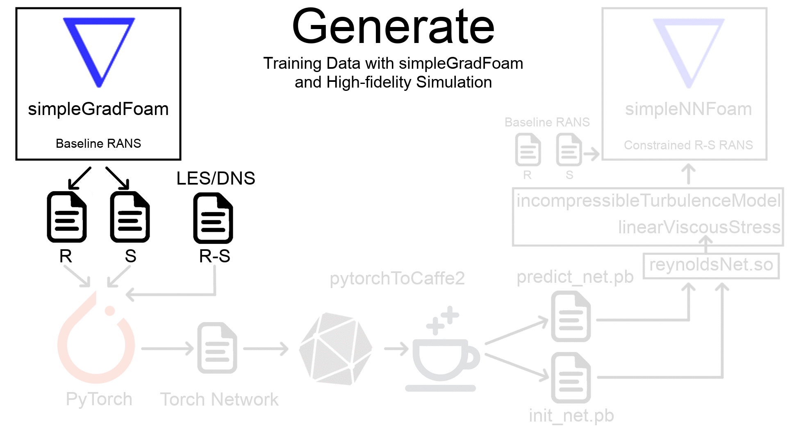

# Deep Learning in OpenFOAM

[Quantifying model form uncertainty in Reynolds-averaged turbulence models with Bayesian deep neural networks](https://arxiv.org/pdf/1807.02901.pdf)

[Nicholas Geneva](http://nicholasgeneva.com/), [Nicholas Zabaras](https://www.zabaras.com)

This repository contains programs related to the implementation of Stochastic Data-Diven RANS (SDD-RANS). Due to the constant changes with needed libraries, the following does not aim to be a functioning package but rather a reference for others to understand our approach for incoorporating deep learning into OpenFOAM. In this application we use Caffe2's C++ backend to directly integrate deep neural networks into OpenFOAM. This requires the user to have sufficient knowledge on linking C++ compiler libraries, wmake and OpenFOAM's general structure.

## Contents
* `solvers/simpleGradFoam` - A slightly modified version of the incompressible solver simpleFoam used for obtaining the baseline RANS data. This solver additionally outputs the scaled rate-of-strain and symmetric tensors needed for the neural network as well as a few additional flow features.
* `pytorchToCaffe2.py` -  A script for converting PyTorch neural networks into Caffe2's protobuf format to be read in C++.
* `TurbulenceModels/turbulenceModels/ReynoldsNet` - An OpenFOAM library used for loading and executing neural networks using Caffe2's mysterious C++ API. This approach avoids explicitly programming neural network architectures in C++, allowing for rapid testing and modification of neural networks used.
* `TurbulenceModels/incompressible` - The ReynoldsNet library is then called by a modified incompressible turbulence model library with an additional *divDevRhoReff(U, S, R)* function that does the data-driven prediction. This function can be found in linearViscousStress class.
* `solvers/simpleNNFoam` -  A slightly modified version of the incompressible solver simpleFoam used to solve the constrained R-S RANS equations yeilding flow field predictions. Note that this solver is ran after an initial baseline simulation using *simpleGradFoam* for a particular test flow since converged RANS flow features are needed for model predictions.

Stochastic Data-Driven RANS Framework |
| ------------- |
|

> The OpenFOAM files included are only the modified ones. For compiling one needs the remainder of turbulent model files required for the incompressible turbulence model.

## Dependencies
* Python 3.6.5
* [PyTorch](https://pytorch.org/) 1.0.0
* [ONNX](https://onnx.ai/)
* [Caffe 2](https://caffe2.ai/)
* [OpenFOAM](https://www.openfoam.com/) 4.1

*Listed versions were used for development. Compatability with newer versions is likely but not guaranteed.*

## Citation
Find this useful? Cite us with:
```latex
@article{geneva2018quantifying,
  title={Quantifying model form uncertainty in Reynolds-averaged turbulence models with Bayesian deep neural networks},
  author={Geneva, Nicholas and Zabaras, Nicholas},
  journal={arXiv preprint arXiv:1807.02901},
  year={2018}
}
```
